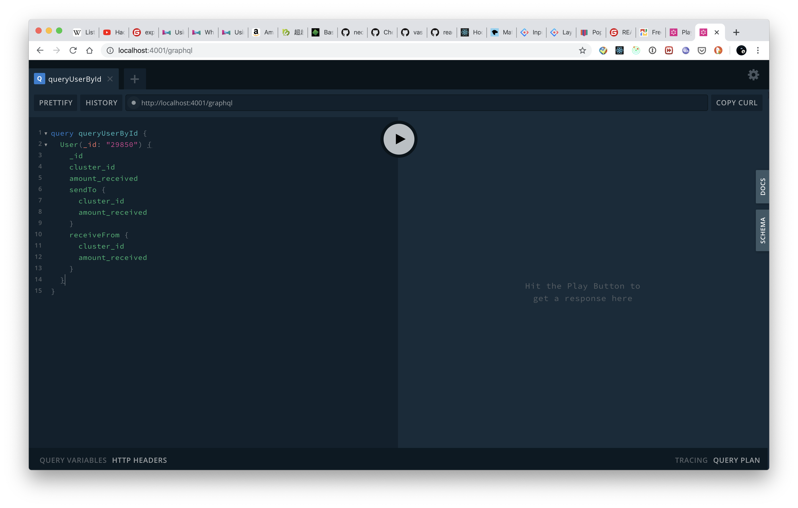

# Block Space MonoRepo - Graphql hosting + UI

This monorepo is started from `GRANDstack Starter`. If there is anything unclear about the dependency install / service start, you can get more details by visiting their [official README](https://github.com/grand-stack/grand-stack-starter).

## Proof of concept:


## DEV - GraphQL Server

1. Setup local Neo4J database (port: 7687, password: letmein), if you haven't done so already, seed the database using `graph.db.dump`.
1. Install plugin `APOC` for the local database
1. Setup local graphql server
   ```
   cd ./api
   npm install
   npm start
   ```
1. Visit GraphiQL web app http://localhost:4001/graphql/.
1. Copy & Paste the following query to verify it's working.
   ```graphql
   query queryUserById {
     User(_id: "24767") {
       _id
       cluster_id
       amount_received
       transactions {
         from {
           number_of_transactions
           User {
             _id
             cluster_id
             amount_received
           }
         }
         to {
           _id
           number_of_transactions
           User {
             _id
             cluster_id
             amount_received
           }
         }
       }
     }
   }
   ```



## GraphQL queries 样例

下面的 queries 可以直接粘贴到 http://localhost:4001/graphql 里测试和使用

```graphql
query getAddressesByTransactionId($transactionId: Int!) {
  getAddressesByTransactionId(transactionId: $transactionId) {
    transactionId
    numberOfTransactions
    fromNodeAddress
    fromNodeAmountReceived
    toNodeAddress
    toNodeAmountReceived
  }
}

query getUsersByTransactionId($transactionId: Int!) {
  getUsersByTransactionId(transactionId: $transactionId) {
    transactionId
    numberOfTransactions
    fromNodeClusterId
    fromNodeAmountReceived
    toNodeClusterId
    toNodeAmountReceived
  }
}

mutation calcSquare {
  Square(number: 5)
}

mutation AppendSearchHistory {
  AppendSearchHistory(userId: "1498302", searchTerm: "dogecoin") {
    id
    username
    lastVisitedAt
    searchHistory
  }
}

query listAddresses {
  Address {
    _id
    address
    amount_received
  }
}

query fetchAddress($address: String) {
  Address(address: $address) {
    _id
    address
    amount_received
    description
    transactions {
      from {
        number_of_transactions
        Address {
          _id
          address
          amount_received
          transactions {
            from {
              _id
              number_of_transactions
              Address {
                address
                amount_received
              }
            }
          }
        }
      }
      to {
        number_of_transactions
        Address {
          _id
          address
          amount_received
          transactions {
            to {
              _id
              number_of_transactions
              Address {
                address
                amount_received
              }
            }
          }
        }
      }
    }
  }
}

query queryUserById($userId: String) {
  User(_id: $userId) {
    _id
    cluster_id
    amount_received
    transactions {
      from {
        number_of_transactions
        User {
          _id
          cluster_id
          amount_received
        }
      }
      to {
        _id
        number_of_transactions
        User {
          _id
          cluster_id
          amount_received
        }
      }
    }
  }
}

query listUsersByCluster($clusterId: Int!) {
  User(cluster_id: $clusterId) {
    _id
    cluster_id
    amount_received
    transactions {
      from {
        _id
        number_of_transactions
        User {
          _id
          cluster_id
          amount_received
        }
      }
      to {
        _id
        number_of_transactions
        User {
          _id
          cluster_id
          amount_received
        }
      }
    }
  }
}
```

GraphQL variables that works with the queries above:

```json
{
  "address": "15xif4SjXiFi3NDEsmMZCfTdE9jvvVQrjU",
  "userId": "24767",
  "clusterId": 897,
  "transactionId": 27657
}
```

## GraphQL Server 开发细节

下面部分假设已经了解了 GraphQL 和 Neo4J 的概念，为什么要用它们，以及常见术语。具体信息可以参考下面的链接。

1. [为什么用 GraphQL](https://dzone.com/refcardz/an-overview-of-graphql?chapter=1)
1. [Apollo Server](https://www.apollographql.com/docs/apollo-server/)（GraphQL Server 实现）
1. [GraphQL+Neo4J](https://egghead.io/courses/build-a-neo4j-graphql-api)

文件解释：
包含主要商务逻辑的文件

- [api/src/schema.graphql](api/src/schema.graphql) - 定义 GraphQL type 的文件，其中包括 Neo4J 数据库中映射过来的 type，以及一些自定义的 type 样例。[参考文档](https://grandstack.io/docs/guide-graphql-schema-design.html)
- [api/src/mutations.js](api/src/mutations.js) - 自定义的 mutations，可以用来添加复杂逻辑。与 schema.graphql 配合使用。
- [api/src/graphql-schema.js](api/src/graphql-schema.js) - 定义 GraphQL resolvers
- [api/src/index.js](api/src/index.js) - 配置 ApolloServer 和 GraphQL schema
